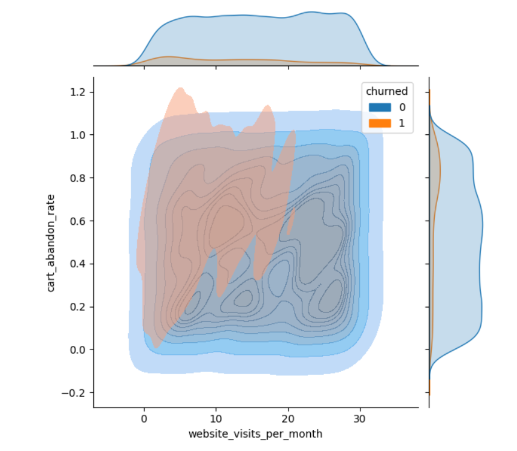
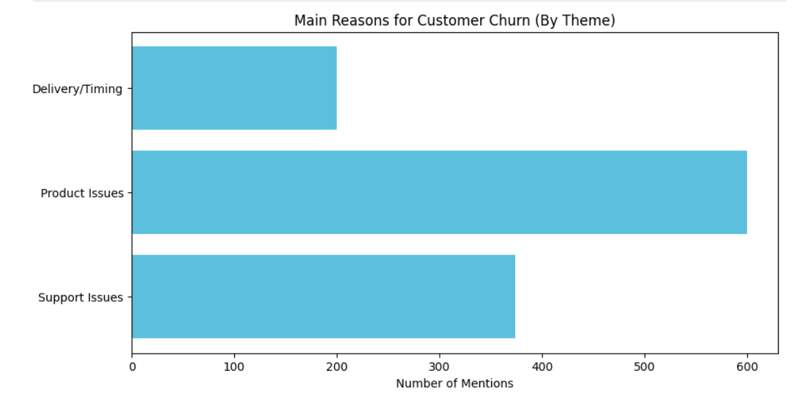

# 📊 E-Commerce Churn & Feedback Analysis

### 📝 Project Overview
I analyzed a dataset of 10,000 customers to find out why users were leaving the platform. This project combines behavioral data (like cart abandonment) with sentiment analysis of customer feedback to provide a full picture of the "Why" behind the churn.

---

### 🚀 Key Findings
* **The "Smoking Gun":** Churned users have a **63% cart abandonment rate**, compared to a much lower rate for active users. The friction is happening at the final step of the purchase.
* **Neutral Factors:** Factors like **Age and Income** showed almost zero correlation with churn ($r \approx -0.03$), meaning this is a platform-wide issue, not a targeting one.
* **Customer Voice:** Most complaints centered around **Product Quality** ("broke", "poor") and **Support Friction** ("unhelpful").

---

### 📊 Visual Insights

**Checkout Friction:**

**Feedback Themes:**

---

### 🛠️ Tools Used
* **Python** (Pandas, NumPy)
* **Data Visualization** (Matplotlib, Seaborn)
* **Text Analysis** (Counter, Keyword Mapping)

---

### 💡 My Process & AI Oversight
In this project, I used AI to help streamline Python logic. However, I applied a "Human Filter" to ensure accuracy—for example, when the initial code struggled with unique text strings in feedback, I pivoted to a keyword-grouping strategy to ensure the final themes were actually meaningful for a business.
